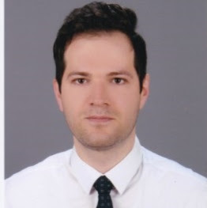

<!-- This code removes the sidebar from second page onwards -->
```{css, echo=FALSE}
.pagedjs_page:not(:first-of-type) {
  --sidebar-width: 0rem;
  --sidebar-background-color: #ffffff;
  --main-width: calc(var(--content-width) - var(--sidebar-width));
  --decorator-horizontal-margin: 0.2in;
}
```

Aside
================================================================================


{width=80%}


Contact Info {#contact}
--------------------------------------------------------------------------------

- <i class="fa fa-envelope"></i> ebadimalek@yahoo.com
- <i class="fa fa-phone"></i> +90 539-716-0726
- For more information, please visit my personal website under
- <i class="fa fa-globe"></i> [ebadi-malek.me](https://ebadi-malek.me)
- <i class="fa fa-github"></i> [github.com/mebdix](https://github.com/mebdix)
- <i class="fa fa-linkedin"></i> [linkedin.com/in/malekebadi/](https://linkedin.com/in/malekebadi/)

TECHNICAL Skills {#skills}
--------------------------------------------------------------------------------

- Modeling and decision making in healthcare, Maintenance, crowdsourcing 

- Supply chain management, multiplayer decision making and contracting

- Operations research, optimization, stochastic modeling, statistical analysis


Disclaimer {#disclaimer}
--------------------------------------------------------------------------------

This resume was made with the R package [**pagedown**](https://github.com/rstudio/pagedown).

Last updated on `r Sys.Date()`.


<i class='fas fa-download'></i> [Download PDF](https://www.ebadi-malek.me/media/MalekEbadiResume.pdf).


Main
================================================================================

Malek Ebadi {#title}
--------------------------------------------------------------------------------
### Industrial Engineer Ph.D.
### Currently searching for a job

- Operations Research, Operations Management, Decision making under uncertainty 
- My academic research primarily concerns healthcare decision making 
- If you are interested in my background and skills, please feel free to contact me or visit my personal [**website**](https://ebadi-malek.me).


Education {data-icon=graduation-cap data-concise=true}
--------------------------------------------------------------------------------

### Sabanci University 

Ph.D. in Industrial Engineering

Istanbul, Turkey

2021

Thesis: Dyadic wavelet and its application in edge detection

### Bilkent University 

M.Sc. in Industrial Engineering

Ankara, Turkey

2014

Thesis: A multi-omics study for intra-individual divergence of the distributions between mRNA isoforms in mammals

### University of Tabriz

B.Sc. in Civil Engineering

Tabriz, Iran

2010


Professional Experience {data-icon=suitcase}
--------------------------------------------------------------------------------

### Research Collaborator, Business Analyst, Part-time

BEYLER GROUP (Hospital & Health Care).

Ankara, Turkey

July 18 - Jan 21

::: concise
- Drafting Projects. 
- Holding seminars, presenting project proposals
:::

### Intern

BEYLER GROUP.

Ankara, Turkey

2018

::: concise
- Analyzed data. 
- Wrote research and analysis reports.
- Conducted case studies to improve process efficiency.
:::

### Business Analyst, Part-time

SILA GROUP (Hospital & Health Care).

Ankara, Turkey

Sep. 14 - Feb. 15

::: concise
- Drafting Projects. 
- Holding seminars, presenting project proposals
:::

### Intern

SILA GROUP.

Ankara, Turkey

Feb. 14 - July 14

::: concise
- Analyzed data. 
- Wrote research and analysis reports.
- Conducted case studies to improve process efficiency.
:::

Teaching/Research Experience <i class="fas fa-chalkboard-teacher"></i>
--------------------------------------------------------------------------------

### Teaching Assistant.

Teaching assistant of different courses including stochastic processes, discrete event simulation, statistics, quality control at SU

Istanbul, Turkey

2015 - 2021


Selected Publications/Talks {data-icon=file}
--------------------------------------------------------------------------------

### Personalized Cotesting Policies for Cervical Cancer Screening: A POMDP Approach.

Journal of Mathematics, Special Issue Markov-Chain Modelling and Applications, Mathematics 2021, 9(6), 679; [https://doi.org/10.3390/math9060679](https://doi.org/10.3390/math9060679)

Basel, Switzerland

2021

M Ebadi, R Akhavan-Tabatabaei

### Analysis Of Overdiagnosis In Cervical Cancer Screening Using An Incidence Based Personalized POMDP Model.

INFORMS, October 24-27, 2021.

Anaheim, CA, USA

2021 

M Ebadi, R Akhavan-Tabatabaei


### Personalised Medicine - From Vision to Practice

ICPerMed, 25-26 February 2021.

Paris, France

2021

### An Approximate Grid-based Solution Method for POMDPs: The case of personalized cervical cancer screening policies

Institute of Applied Physical Sciences and Engineering, Duke Kunshan University, China, November 13, 2020

Jiangsu, China

2020

M Ebadi, Esma Gel, R Akhavan-Tabatabaei

### A Constrained POMDP Model for Optimized Allocation of Cervical Cancer Screening Resources

8th Annual Koc University Healthcare Operations Workshop, June 28th, 2019

Ist, Turkey

2019

M Ebadi, R Akhavan-Tabatabaei

### Optimal Cervical Cancer Screening Under Societal Perspective

EURO, July 2018

Valencia, Spain

2018

M Ebadi, Hans Frenk, R Akhavan-Tabatabaei

### Optimizing Cervical Cancer Screening Using A POMDP Model

INFORMS, June 29, 2017

Amsterdam, Netherlands 

2017

M Ebadi, Hans Frenk, R Akhavan-Tabatabaei


Grant and Awards {data-icon=trophy}
--------------------------------------------------------------------------------

### Full scholarship for Ph.D. studies

Sabanci University

SU, Turkey   

2015

### DAAD scholarship 

Summer School 

Berlin, Germany   

2014

### Full scholarship for M.Sc. studies

Bilkent University

Ankara

2011

Programming and Scripting {data-icon=code}
--------------------------------------------------------------------------------

### Matlab, R, Latex

Skill level: experienced

$\phantom{BB}$

$\phantom{BB}$


Training and Courses {data-icon=book}
--------------------------------------------------------------------------------

### Data scientist professional certificate with R (ongoing)

[Datacamp](https://app.datacamp.com/learn) 

Datacamp

2021


### Reinforcement Learning (ongoing)

[Coursera](https://coursera.com)

Coursera

2021


Language {data-icon=language}
--------------------------------------------------------------------------------

### English

Fluent (C1, TOEFL 110)

--------------------------------------------------------------------------------

### German 

Fluent (C1, GOETHE Zertifikat B2)

--------------------------------------------------------------------------------

### Turkish 

Fluent (C1)

--------------------------------------------------------------------------------

### Persian 

Fluent (C1)

--------------------------------------------------------------------------------

### French 

Basic (A2)

--------------------------------------------------------------------------------

### Azerbaijani 

Native


